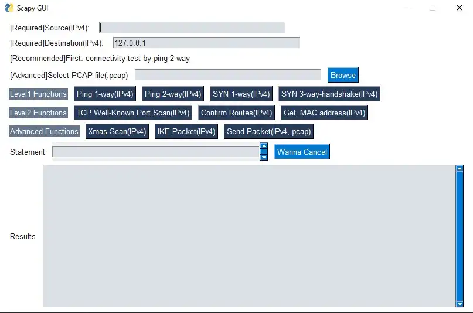

# scapy_GUI_for_Beginners
## Summary
Use scapy library in operating GUI(You must install "PySimpleGUI" and "scapy" via pip)

## GUI Image

## Note
[Info]Because of security and Using at beginners's ease, Not include anything to attack like sniffing and spoofing

## References
・About Scapy: https://scapy.readthedocs.io/en/latest/usage.html
・About PySimpleGUI: https://github.com/PySimpleGUI/PySimpleGUI
